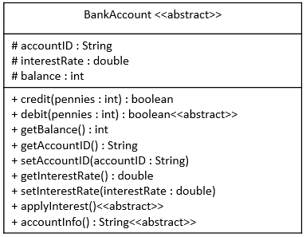

# BankAccount Java Abstract Class

## Required Skills Inventory
To complete this task, you should be familiar with the following concepts and skills:
- Java programming language

- Object-oriented programming (OOP) concepts
- Abstract classes and methods
- Implementing class inheritance
- Understanding UML Class Diagrams and translating them to Java code

## Problem Description and Given Info
You are required to create a public abstract class named `BankAccount` in Java, following the Interface specifications given in the provided UML Class Diagram. The abstract class represents a generic bank account and contains fields and methods as described below.

### BankAccount Class Diagram

<p align="center">
  
</p>

### Structure of the Fields
As described by the UML Class Diagram, your `BankAccount` class must have the following fields:
```java
protected String accountID = "0000-0000-0000-0000";
protected double interestRate = 0.0;
protected int balance = 0;
```

### Structure of the Methods
As described by the UML Class Diagram, your `BankAccount` class must have the following methods:
```java
public boolean credit(int amount);
public abstract boolean debit(int amount);
public int getBalance();
public String getAccountID();
public void setAccountID(String accountID);
public double getInterestRate();
public void setInterestRate(double interestRate);
public abstract void applyInterest();
public abstract String accountInfo();
```

### Behavior of the Methods
1. The `credit` method should add the `amount` argument to the `balance`.

2. The `debit` method is abstract, so there will be no behavior or method body for it. This will be implemented in the subclasses that extend `BankAccount`.
3. The `getBalance` method should return the current balance.
4. The `getAccountID` method should return the accountID.
5. The `setAccountID` method should store the argument value in the `accountID` field.
6. The `getInterestRate` method should return the interestRate.
7. The `setInterestRate` method should store the argument amount in the `interestRate` field.
8. The `applyInterest` method is abstract, so there will be no behavior or method body for it. This will be implemented in the subclasses that extend `BankAccount`.
9. The `accountInfo` method is abstract, so there will be no behavior or method body for it. This will be implemented in the subclasses that extend `BankAccount`.

### Additional Information
- Since this is an abstract class, you will not be able to instantiate any object from it.
- You are given a `TestAccount` class that extends `BankAccount`. You may use this to help with testing your `BankAccount` class.

- You are also given a `Main` class with a `main` method where you can write code to test your `BankAccount` class.
- All bank accounts use balance, credit, and debit amounts, and fees stored and passed as a number of pennies (int).
- All debit amounts will be subtracted from the balance, and all credit amounts will be added to the balance.
- All bank accounts have a non-negative interest rate (0.02 would be a 2% interest rate).
- The `credit` method will always return `true`.

## Getting Started
1. Create a new Java project in your favorite IDE or editor.

2. Define a new Java file called `BankAccount.java`.
3. Implement the `BankAccount` class according to the provided UML Class Diagram and method behavior descriptions.
4. Create additional Java files for subclasses (e.g., `SavingsAccount.java`, `CheckingAccount.java`) that extend `BankAccount` if needed.
5. Implement the abstract methods in the subclasses.
6. Use the `TestAccount` and `Main` classes to test your `BankAccount` and its subclasses.

## Example Usage
```java
// Sample usage of BankAccount and its subclasses
public class Main {
    public static void main(String[] args) {
        // Example code to create and use bank accounts
        // (This is just a sample and not a comprehensive test)

        // Creating a savings account
        BankAccount savingsAccount = new SavingsAccount("1234-5678-9012-3456");
        savingsAccount.setInterestRate(0.05); // Set a 5% interest rate
        savingsAccount.credit(1000); // Credit 1000 pennies (i.e., $10)
        savingsAccount.applyInterest(); // Apply the interest rate
        System.out.println("Savings Account Balance: " + savingsAccount.getBalance());

        // Creating a checking account
        BankAccount checkingAccount = new CheckingAccount("9876-5432-1098-7654");
        checkingAccount.credit(500); // Credit 500 pennies (i.e., $5)
        checkingAccount.debit(200); // Debit 200 pennies (i.e., $2)
        System.out.println("Checking Account Balance: " + checkingAccount.getBalance());

        // Print account information
        System.out.println("Savings Account Info: " + savingsAccount.accountInfo());
        System.out.println("Checking Account Info: " + checkingAccount.accountInfo());
    }
}
```

## Notes
- The provided example usage is for demonstration purposes only and might not cover all possible scenarios. Consider writing more comprehensive tests to validate the correctness of your `BankAccount` and its subclasses.

- Be sure to handle edge cases, such as negative debit amounts or negative interest rates, appropriately in your implementations.
- Comment your code adequately, explaining your thought process and any assumptions you make during implementation.

## Solution 

To see the code solution, please check the following file:

* [Main.java](/Projects_03/Bank_Account/Main.java)

* [BankAccount.java](/Projects_03/Bank_Account/BankAccount.java)
* [TestAccount.java](/Projects_03/Bank_Account/TestAccount.java)

---