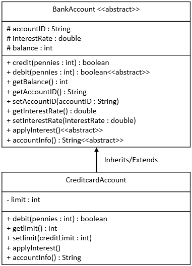

# CreditcardAccount Java Class

## Required Skills Inventory
To complete this task, you should be familiar with the following concepts and skills:
- Java programming language

- Object-oriented programming (OOP) concepts
- Implementing inheritance in Java
- Overriding methods in subclasses
- Understanding UML Class Diagrams and translating them to Java code

## Problem Description and Given Info
You are required to create a public class named `CreditcardAccount` in Java, which inherits (extends) the `BankAccount` class. The `CreditcardAccount` class has specific fields and methods as described below, and it overrides and implements some of the abstract methods defined in the `BankAccount` base class.

### Creditcard Account Inherits BankAccount Class Diagram

<p align="center">
  
</p>

### Structure of the Fields
As described by the UML Class Diagram, your `CreditcardAccount` class must have the following field:
```java
private int limit = 0;
```

### Structure of the Methods
As described by the UML Class Diagram, your `CreditcardAccount` class must have the following methods:
```java
public boolean debit(int amount);
public void setLimit(int limit);
public int getLimit();
public void applyInterest();
public String accountInfo();
```

### Behavior of the Methods
1. The `debit` method should subtract the `amount` argument from the balance, but only if the amount would not cause the current balance to violate the credit limit. This method should return `true` if the amount was subtracted from the balance; otherwise, it should return `false`.

2. The `setLimit` method should store the argument amount in the `limit` field.
3. The `getLimit` method should return the value stored in the `limit` field.
4. The `applyInterest` method should compute the interest amount and add this amount to the balance, but only if the balance is less than 0. The interest amount is calculated by multiplying the balance by the interest rate (e.g., if the interest rate is 0.02, the interest amount is `balance * 0.02`).
5. When applying interest, the interest amount is always added to the balance, and any fractional part will be rounded down (i.e., truncated).
6. Interest will not be applied to any Savings or Checking account with a balance of zero or less.
7. The `accountInfo` method will return a string formatted exactly like this:
```
Type of Account : Creditcard
Account ID      : 1111-2222-3333-4444
Current Balance : $123.45
Interest rate   : 1.50%
Credit Limit    : $10000.00
```

### Additional Information
- All bank accounts use balance, credit, and debit amounts, fees, and limits stored and passed as a number of pennies (int).

- All debit amounts will be subtracted from the balance, and all credit amounts will be added to the balance.
- All bank accounts have a non-negative interest rate (0.02 would be a 2% interest rate).
- When applying interest, the interest amount is calculated by multiplying the balance by the interest rate.
- When applying interest, the interest amount is always added to the balance, and any fractional part will be rounded down.
- Interest will not be applied to any Savings or Checking account with a balance of zero or less.
- Debit methods will return false if the transaction cannot be made because of insufficient balance or insufficient credit limit. Otherwise, they will return true.
- The credit method in the `BankAccount` base class will always return `true`.
- The balance of a `CreditcardAccount` cannot overrun its credit limit.
- The `debit` method for the `CreditcardAccount` will return false if an attempt to overdraw the account is made.
- The balance of a `CreditcardAccount` will generally be negative because when you spend money on a credit card, you are borrowing money, and the negative balance reflects money that you owe.
- The credit limit will be stored as a positive value. For example, a credit limit of $10000.00 will be stored in the `limit` field as the int value 1000000.
- Interest will not be applied to a `CreditcardAccount` with a positive or zero balance.

## Getting Started
1. Create a new Java file named `CreditcardAccount.java`.

2. Define the `CreditcardAccount` class that extends the `BankAccount` class.
3. Implement the abstract methods (`debit`, `applyInterest`, and `accountInfo`) in the `CreditcardAccount` class, overriding the respective methods from the `BankAccount` class.
4. Implement the `setLimit` and `getLimit` methods for the `CreditcardAccount` class.
5. Test your `CreditcardAccount` class by using the provided `TestAccount` and `Main` classes or by creating additional test cases.

## Example Usage
```java
// Sample usage of CreditcardAccount
public class Main {
    public static void main(String[] args) {
        // Example code to create and use a CreditcardAccount
        // (This is just a sample and not a comprehensive test)

        // Creating a CreditcardAccount
        CreditcardAccount creditcardAccount = new CreditcardAccount("1111-2222-3333-4444");
        creditcardAccount.setInterestRate(0.015); // Set a 1.5% interest rate
        creditcardAccount.setLimit(1000000); // Set a credit limit of $10000.00

        // Credit 2000 pennies (i.e., $20)
        creditcardAccount.credit(2000);
        // Debit 1500 pennies (i.e., $15) - This will succeed and reduce the balance to $5
        boolean debitSuccess = creditcardAccount.debit(1500);
        System.out.println("Debit success: " + debitSuccess);
        System.out.println(creditcardAccount.accountInfo());

        // Attempt to debit more than the current balance
        boolean debitExceedLimit = creditcardAccount.debit(10000);
        System.out.println("Debit exceed limit: " + debitExceedLimit);
        System.out.println("Current Balance: " + creditcardAccount.getBalance());
    }
}
```

## Notes
- The provided example usage is for demonstration purposes only and might not cover all possible scenarios. Consider writing more comprehensive tests to validate the correctness of your `CreditcardAccount` class.

- Be sure to handle edge cases, such as checking for debit limit violations or applying interest to a positive or zero balance, appropriately in your implementations.
- Comment your code adequately, explaining your thought process and any assumptions you make during implementation.

## Solution 

To see the code solution, please check the following file:

* [Main.java](/Projects_03/CreditCard_Account/Main.java)

* [BankAccount.java](/Projects_03/CreditCard_Account/BankAccount.java)
* [CreditcardAccount.java](/Projects_03/CreditCard_Account/CreditcardAccount.java)


---