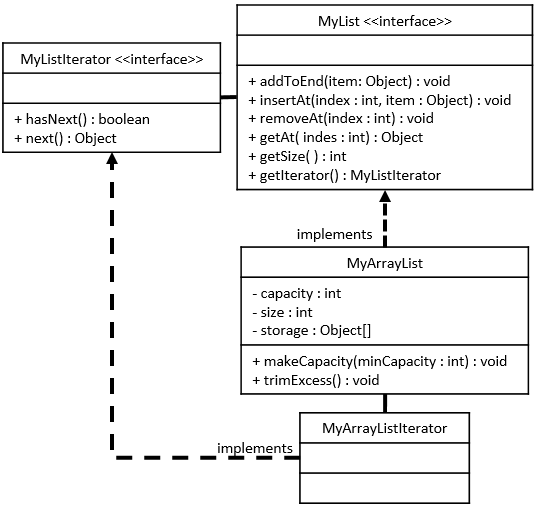

# MyArrayList Java Class

## Required Skills Inventory
To complete this task, you should be familiar with the following concepts and skills:
- Java programming language

- Implementing Java interfaces based on given UML specifications
- Working with arrays in Java

## Problem Description and Given Info
You are required to create a public class named `MyArrayList` in Java, which implements the `MyList` interface. The `MyArrayList` class has specific fields and methods as described below.

### MyArrayList Class Diagram

<p align="center">
  
</p>

### Structure of the Fields
As described by the UML Class Diagram above, your `MyArrayList` class must have the following fields:
```java
private int capacity = 8;
private int size = 0;
private Object[] storage = new Object[8];
```

### Structure of the Methods
As described by the UML Class Diagram above, your `MyArrayList` class must have the following methods:
```java
public void addToEnd(Object obj);
public void insertAt(int index, Object obj);
public void removeAt(int index);
public Object getAt(int index);
public int getSize();
public void makeCapacity(int minCapacity);
public void trimExcess();
```

### Method Descriptions
1. `addToEnd` method:
   - Appends a new item to the end of the list.

   - If the current size is equal to the current capacity, then this list is full to its current capacity, and capacity will need to be increased before we can append the new element. To increase the capacity, call the `makeCapacity` method with an argument value that is twice the current capacity.

2. `insertAt` method:
   - Makes a place at the specified index by moving all items at this index and beyond to the next larger index.

   - Throws a `NoSuchElementException` if the specified index is less than 0 or greater than size.
   - If the current size is equal to the current capacity, then this list is full to its current capacity, and capacity will need to be increased before we can insert the new element. To increase the capacity, call the `makeCapacity` method with an argument value that is twice the current capacity.

3. `removeAt` method:
   - Removes the element at the specified index and moves all elements beyond that index to the next lower index.

   - Throws a `NoSuchElementException` if the specified index is less than 0 or greater than or equal to size.

4. `getAt` method:
   - Returns the item at the specified index.

   - Throws a `NoSuchElementException` if the specified index is less than 0 or greater than or equal to size.

5. `getSize` method:
   - Returns the number of elements currently stored in the list.

6. `makeCapacity` method:
   - This method will take a `minCapacity` as an `int` argument.

   - If `minCapacity` is less than the current size or equal to the capacity, then this method should take no action.
   - Otherwise, the capacity of this `MyArrayList` must be changed to either 8 or `minCapacity` (whichever is greater).
   - If the capacity is to be changed, then this method will:
     - Allocate a new array of `Object` sized to the new capacity.
     - Copy over all elements from the old array to the new array.
     - Store the new array in the private `storage` variable for this instance.

7. `trimExcess` method:
   - This method will remove any excess capacity by simply calling the `makeCapacity` method with an argument value that is equal to the current size of this list.

## Getting Started
1. Create a new Java file named `MyArrayList.java`.

2. Define the `MyArrayList` class that implements the `MyList` interface.

3. Implement all the methods mentioned above in the `MyArrayList` class.

4. You may use the `MyListIterator` class provided in the `MyArrayList.java` file.

5. Test your `MyArrayList` class by using the provided `Main.java` class or by creating additional test cases.

## Example Usage
```java
// Sample usage of MyArrayList
public class Main {
    public static void main(String[] args) {
        // Example code to create and use a MyArrayList
        // (This is just a sample and not a comprehensive test)

        // Creating a MyArrayList
        MyArrayList myList = new MyArrayList();

        // Adding elements to the list
        myList.addToEnd(10);
        myList.addToEnd(20);
        myList.addToEnd(30);

        // Inserting an element at a specific index
        myList.insertAt(1, 15); // myList: {10, 15, 20, 30}

        // Removing an element at a specific index
        myList.removeAt(2); // myList: {10, 15, 30}

        // Getting an element at a specific index
        Object element = myList.getAt(2); // element: 30

        // Getting the size of the list
        int size = myList.getSize(); // size: 3

        // Adjusting the capacity
        myList.makeCapacity(10); // Capacity increased to 10 elements

        // Removing any excess capacity
        myList.trimExcess(); // Capacity reduced to match the current size
    }
}
```

## Notes
- The provided example usage is for demonstration purposes only and might not cover all possible scenarios. Consider writing more comprehensive tests to validate the correctness of your `MyArrayList` class.

- Comment your code adequately, explaining your thought process and any assumptions you make during implementation.
- Be sure to handle edge cases appropriately, such as checking for index bounds in methods like `insertAt`, `removeAt`, and `getAt`.

## Solution 

To see the code solution, please check the following file:

* [Main.java](/Projects_04/MyArrayList/Main.java)

* [MyArrayList.java](/Projects_04/MyArrayList/MyArrayList.java)
* [MyList.java](/Projects_04/MyArrayList/MyList.java)
* [MyListIterator.java](/Projects_04/MyArrayList/MyListIterator.java)

---