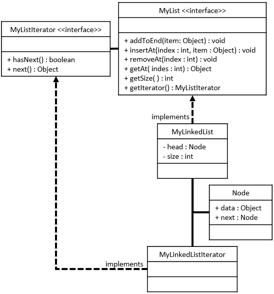

# MyLinkedList

## Required Skills Inventory
To complete this task, you should be familiar with the following concepts and skills:
- Java programming language

- Implementing Java interfaces based on given UML specifications
- Understanding linked lists and their node structure
- Implementing linked list functionality without using standard Java collection types or arrays

## Problem Description and Given Info
You are required to create a public class named `MyLinkedList` in Java, which implements the `MyList` interface. The `MyLinkedList` class has specific fields and methods as described below.

### MyLinkedList Class Diagram

<p align="center">
  
</p>

### Structure of the Fields
As described by the UML Class Diagram above, your `MyLinkedList` class must have the following fields:
```java
private Node head = null;
private int size = 0;
```

### Structure of the Methods
As described by the UML Class Diagram above, your `MyLinkedList` class must have the following methods:
```java
public void addToEnd(Object obj);
public void insertAt(int index, Object obj);
public void removeAt(int index);
public Object getAt(int index);
public int getSize();
```

### Method Descriptions
1. `addToEnd` method:
   - Appends a new item to the end of the list.

   - This method will construct a new `Node` object whose data is the element to be added and place this `Node` appropriately into the list.

2. `insertAt` method:
   - Inserts a new `Node` at the specified index in the list.

   - Throws a `NoSuchElementException` if the specified index is less than 0 or greater than size.
   - This method will construct a new `Node` object whose data is the element to be added and place this `Node` appropriately into the list.

3. `removeAt` method:
   - Removes the element at the specified index.

   - Throws a `NoSuchElementException` if the specified index is less than 0 or greater than or equal to size.

4. `getAt` method:
   - Returns the item at the specified index.
   
   - Throws a `NoSuchElementException` if the specified index is less than 0 or greater than or equal to size.

5. `getSize` method:
   - Returns the number of elements currently stored in the list.

### Additional Information
- `MyLinkedList` concrete class will store its elements in `Node` objects.

- Each `Node` object has a data variable that stores the element and a next variable that stores a reference to the next `Node` object in the list.
- Each instance of `MyLinkedList` has a `Node` variable called `head`.
- When size is 0, then `head` is null. When size is not 0, then `head` is a reference to the first `Node` object.
- For each `Node` object in the list, if this `Node`'s next is null, then this is the last `Node` in the list.

## Getting Started
1. Create a new Java file named `MyLinkedList.java`.

2. Define the `MyLinkedList` class that implements the `MyList` interface.

3. Implement all the methods mentioned above in the `MyLinkedList` class.

4. Implement the `Node` class (if not already implemented) in the `MyLinkedList` class.

5. Test your `MyLinkedList` class by using the provided `Main.java` class or by creating additional test cases.

## Example Usage
```java
// Sample usage of MyLinkedList
public class Main {
    public static void main(String[] args) {
        // Example code to create and use a MyLinkedList
        // (This is just a sample and not a comprehensive test)

        // Creating a MyLinkedList
        MyLinkedList myList = new MyLinkedList();

        // Adding elements to the list
        myList.addToEnd(10);
        myList.addToEnd(20);
        myList.addToEnd(30);

        // Inserting an element at a specific index
        myList.insertAt(1, 15); // myList: {10, 15, 20, 30}

        // Removing an element at a specific index
        myList.removeAt(2); // myList: {10, 15, 30}

        // Getting an element at a specific index
        Object element = myList.getAt(2); // element: 30

        // Getting the size of the list
        int size = myList.getSize(); // size: 3
    }
}
```

## Notes
- The provided example usage is for demonstration purposes only and might not cover all possible scenarios. Consider writing more comprehensive tests to validate the correctness of your `MyLinkedList` class.

- Comment your code adequately, explaining your thought process and any assumptions you make during implementation.
- Be sure to handle edge cases appropriately, such as checking for index bounds in methods like `insertAt`, `removeAt`, and `getAt`.

## Solution 

To see the code solution, please check the following file:

* [Main.java](/Projects_04/MyLinkedList/Main.java)

* [MyLinkedList.java](/Projects_04/MyLinkedList/MyLinkedList.java)
* [MyList.java](/Projects_04/MyLinkedList/MyList.java)
* [MyListIterator.java](/Projects_04/MyLinkedList/MyListIterator.java)

---