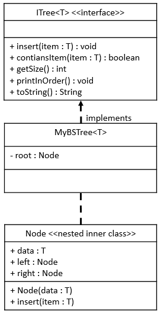

# MyBSTree Java Class

## Required Skills Inventory
To complete this task, you should be familiar with the following concepts and skills:
- Java programming language

- Implementing Java interfaces based on given UML specifications
- Understanding the functionality of a binary search tree (BST) data structure
- Writing recursive methods
- Nested inner class implementation in Java
- Generic types in Java

## Problem Description and Given Info
You are required to create a public class named `MyBSTree` in Java, which implements the `ITree` generic interface. The `MyBSTree` class will represent a binary search tree (BST) and will contain elements stored in a collection of linked binary `Node` objects.

### MyBSTree Class Diagram

<p align="center">
  
</p>

## Structure of the MyBSTree Fields
As described by the UML Class Diagram above, your `MyBSTree` class must have the following field:
```java
private Node<T> root;
```
You may implement any additional fields that you may need.

## Structure of the MyBSTree Methods
As described by the UML Class Diagram above, your `MyBSTree` class must implement the following methods:
```java
public void insert(T item);
public boolean containsItem(T item);
public int getSize();
public void printInOrder();
public String toString();
```
You may implement any additional methods that you may need.

## Node Inner Class
You will also need to implement a nested inner class named `Node` inside your `MyBSTree` class. Each `Node` object will store one piece of data in the binary search tree. The actual data value will be stored in the `data` field of the `Node` object. As these are binary `Node` objects, each `Node` will also store a reference to a left sub-node and a right sub-node. These references will be stored in the `left` and `right` fields.

### Structure of the Node Fields
As described by the UML Class Diagram above, your `Node` inner class must have the following fields:
```java
public T data;
public Node<T> left;
public Node<T> right;
```
You may implement any additional fields that you may need.

### Structure of the Node Methods
Your `Node` inner class must have the following methods:
```java
public Node(T item);
public void insert(T item);
```
You may implement any additional methods that you may need.

### Additional Information
- The `MyBSTree` concrete class will store its elements in a collection of linked binary `Node` objects.

- The `insert` method will insert a new item into the binary search tree in the correct location. There should be no duplicate items in the tree. If an item is inserted and that item is already in the tree, then this method should simply return without changing the state of the tree.
- The `containsItem` method will return `true` if the tree contains the specified item; otherwise, it will return `false`.
- The `getSize` method will return the number of nodes currently stored in this tree.
- The `printInOrder` method will print the items in the tree in a space-separated list in ascending order.
- The `toString` method will return a `String` containing the items in the tree in ascending order and separated by a space.
- Your `Node` inner class must be declared as package level (neither private nor public).
- Implement the recursive `insert` method in the `Node` inner class to find the insertion point and insert a new `Node` for the new item in the correct position in the sub-tree for which this `Node` is the root. Remember that no duplicate items can be stored in the tree.

## Getting Started
1. Create a new Java file named `MyBSTree.java`.

2. Define the `MyBSTree` class that implements the `ITree` interface with a generic type `T`.

3. Implement the `Node` inner class that contains the data and references to the left and right sub-nodes.

4. Implement all the methods mentioned above in the `MyBSTree` class and the `insert` method in the `Node` inner class.

5. Test your `MyBSTree` class by using the provided `Main.java` class or by creating additional test cases.

## Example Usage
```java
// Sample usage of MyBSTree
public class Main {
    public static void main(String[] args) {
        // Example code to create and use a MyBSTree
        // (This is just a sample and not a comprehensive test)

        // Creating a MyBSTree with Integer elements
        MyBSTree<Integer> myTree = new MyBSTree<>();

        // Inserting elements into the tree
        myTree.insert(50);
        myTree.insert(30);
        myTree.insert(70);
        myTree.insert(20);
        myTree.insert(40);
        myTree.insert(60);
        myTree.insert(80);

        // Checking if the tree contains a specific item
        boolean containsItem = myTree.containsItem(60); // containsItem: true

        // Getting the size of the tree
        int size = myTree.getSize(); // size: 7

        // Printing the tree in ascending order
        myTree.printInOrder(); // Output: 20 30 40 50 60 70 80

        // Getting a string representation of the tree in ascending order
        String treeAsString = myTree.toString(); // treeAsString: "20 30 40 50 60 70 80"
    }
}
```

## Notes
- The provided example usage is for demonstration purposes only and might not cover all possible scenarios. Consider writing more comprehensive tests to validate the correctness of your `MyBSTree` class.

- Comment your code adequately, explaining your thought process and any assumptions you make during implementation.
- Handle edge cases and exceptions appropriately, such as checking for duplicate items in the `insert` method or handling an empty tree in the `printInOrder` method.

## Solution 

To see the code solution, please check the following file:

* [Main.java](/Projects_05/MyBSTree/Main.java)

* [ITree.java](/Projects_05/MyBSTree/ITree.java)
* [MyBSTree.java](/Projects_05/MyBSTree/MyBSTree.java)

---