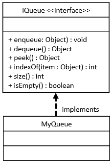

# MyQueue Java Class

## Required Skills Inventory
To complete this task, you should be familiar with the following concepts and skills:
- Java programming language

- Implementing Java interfaces based on given UML specifications
- Understanding the functionality of a queue data structure
- Implementing a queue using either an internal array list or a linked list
- Handling edge cases and exceptions

## Problem Description and Given Info
You are required to create a public class named `MyQueue` in Java, which implements the `IQueue` interface. The `MyQueue` class can be implemented as either an array list or a linked list (using code from your previous `MyArrayList` or `MyLinkedList` submissions). The `MyQueue` must not be arbitrarily limited to any fixed size at runtime.

### MyQueue Class Diagram

<p align="center">
  
</p>

## Structure of the Methods
As described by the UML Class Diagram above, your `MyQueue` class must implement the following methods:
```java
public void enqueue(Object obj);
public Object dequeue();
public Object peek();
public int indexOf(Object obj);
public int size();
public boolean isEmpty();
```

## Method Descriptions
1. `enqueue` method:
   - Add a new item to the end of the queue.

   - For example: given the queue {1, 2, 3} (where the value 1 is at the front and the value 3 is currently at the back) and an instruction to enqueue(99), the result would be this {1, 2, 3, 99}, with the value 99 now at the end of the queue.

2. `dequeue` method:
   - Remove and return the item currently at the front of the queue.

   - For example: given the queue {1, 2, 3} (where the value 1 is at the front and the value 3 is currently at the back) and an instruction to dequeue(), the queue would now look like this {2, 3}, and the value 1 would be returned.
   - Throws a `NoSuchElementException` if the queue is currently empty when this method is called.

3. `peek` method:
   - Return (but do not remove) the item currently at the front of the queue.

   - For example: given the queue {1, 2, 3} (where the value 1 is at the front and the value 3 is currently at the back) and an instruction to peek(), the queue would still look like this {1, 2, 3}, and the value 1 would be returned.
   - Throws a `NoSuchElementException` if the queue is currently empty when this method is called.

4. `indexOf` method:
   - Return the (zero-based) number of elements from the front of the collection where the specified item is first found. Returns -1 if the item is not found in the collection.

   - For example: given the queue {1, 2, 3} (where the value 1 is at the front and the value 3 is currently at the back) and the instruction indexOf(2), the value 1 would be returned (because the value 2 was found at index 1 (1 element after the front) in the queue). For another example: given the queue {1, 2, 3} (where the value 1 is at the front and the value 3 is currently at the back) and the instruction indexOf(99), the value -1 would be returned (because the value 99 is not found in the queue).

5. `size` method:
   - Returns the number of elements currently stored in the queue.

6. `isEmpty` method:
   - Returns true if there are currently no items stored in this queue, otherwise returns false.

### Additional Information
- `MyQueue` concrete class will store its elements either in an internal array list or a linked list.

- All such implementation details must be contained in your `MyQueue.java` file. You may add any additional fields, methods, and inner classes that you will need to achieve this.

## Getting Started
1. Create a new Java file named `MyQueue.java`.

2. Define the `MyQueue` class that implements the `IQueue` interface.

3. Implement all the methods mentioned above in the `MyQueue` class.

4. You may choose to use either an internal array list or a linked list to implement the queue based on your previous `MyArrayList` or `MyLinkedList` work.

5. Test your `MyQueue` class by using the provided `Main.java` class or by creating additional test cases.

## Example Usage
```java
// Sample usage of MyQueue
public class Main {
    public static void main(String[] args) {
        // Example code to create and use a MyQueue
        // (This is just a sample and not a comprehensive test)

        // Creating a MyQueue
        MyQueue myQueue = new MyQueue();

        // Adding elements to the queue
        myQueue.enqueue(10);
        myQueue.enqueue(20);
        myQueue.enqueue(30);

        // Dequeuing and getting the front element
        Object frontElement = myQueue.dequeue(); // frontElement: 10

        // Peeking at the front element
        Object peekedElement = myQueue.peek(); // peekedElement: 20

        // Finding the index of an element
        int index = myQueue.indexOf(20); // index: 1

        // Checking if the queue is empty
        boolean empty = myQueue.isEmpty(); // empty: false
    }
}
```

## Notes
- The provided example usage is for demonstration purposes only and might not cover all possible scenarios. Consider writing more comprehensive tests to validate the correctness of your `MyQueue` class.

- Comment your code adequately, explaining your thought process and any assumptions you make during implementation.
- Handle edge cases and exceptions appropriately, such as checking if the queue is empty before performing a dequeue or peek operation.

## Solution 

To see the code solution, please check the following file:

* [Main.java](/Projects_05/MyQueue/Main.java)

* [IQueue.java](/Projects_05/MyQueue/IQueue.java)
* [MyQueue.java](/Projects_05/MyQueue/MyQueue.java)

---