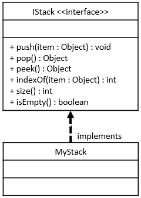

# MyStack Java Class

## Required Skills Inventory
To complete this task, you should be familiar with the following concepts and skills:
- Java programming language

- Implementing Java interfaces based on given UML specifications
- Understanding the functionality of a stack data structure
- Implementing a stack using either an internal array list or a linked list
- Handling edge cases and exceptions

## Problem Description and Given Info
You are required to create a public class named `MyStack` in Java, which implements the `IStack` interface. The `MyStack` class can be implemented as either an array list or a linked list (using code from your previous `MyArrayList` or `MyLinkedList` submissions). The `MyStack` must not be arbitrarily limited to any fixed size at runtime.

### MyStack Class Diagram

<p align="center">
  
</p>

## Structure of the Methods
As described by the UML Class Diagram above, your `MyStack` class must implement the following methods:

```java
public void push(Object obj);
public Object pop();
public Object peek();
public int indexOf(Object obj);
public int size();
public boolean isEmpty();
```

## Method Descriptions
1. `push` method:
   - Add a new item to the top of the stack.

   - For example: given the stack {1, 2, 3} (where the value 1 is on the top) and an instruction to push(99), the result would be this {99, 1, 2, 3}, with the value 99 now on the top of the stack.

2. `pop` method:
   - Remove and return the item currently on the top of the stack.

   - For example: given the stack {1, 2, 3} (where the value 1 is on the top) and an instruction to pop(), the stack would now look like this {2, 3}, and the value 1 would be returned.
   - Throws a `NoSuchElementException` if the stack is currently empty when this method is called.

3. `peek` method:
   - Return (but do not remove) the item currently on the top of the stack.

   - For example: given the stack {1, 2, 3} (where the value 1 is on the top) and an instruction to peek(), the stack would still look like this {1, 2, 3}, and the value 1 would be returned.
   - Throws a `NoSuchElementException` if the stack is currently empty when this method is called.

4. `indexOf` method:
   - Return the (zero-based) number of elements from the top of the collection where the specified item is first found. Returns -1 if the item is not found in the collection.

   - For example: given the stack {1, 2, 3} (where the value 1 is on the top) and the instruction indexOf(2), the value 1 would be returned (because the value 2 was found at index 1 (1 element below the top) in the stack). For another example: given the stack {1, 2, 3} (where the value 1 is on the top) and the instruction indexOf(99), the value -1 would be returned (because the value 99 is not found in the stack).

5. `size` method:
   - Returns the number of elements currently stored in the stack.

6. `isEmpty` method:
   - Returns true if there are currently no items stored in this stack, otherwise returns false.

### Additional Information
- `MyStack` concrete class will store its elements either in an internal array list or a linked list.

- All such implementation details must be contained in your `MyStack.java` file. You may add any additional fields, methods, and inner classes that you will need to achieve this.

## Getting Started
1. Create a new Java file named `MyStack.java`.

2. Define the `MyStack` class that implements the `IStack` interface.

3. Implement all the methods mentioned above in the `MyStack` class.

4. You may choose to use either an internal array list or a linked list to implement the stack based on your previous `MyArrayList` or `MyLinkedList` work.

5. Test your `MyStack` class by using the provided `Main.java` class or by creating additional test cases.

## Example Usage
```java
// Sample usage of MyStack
public class Main {
    public static void main(String[] args) {
        // Example code to create and use a MyStack
        // (This is just a sample and not a comprehensive test)

        // Creating a MyStack
        MyStack myStack = new MyStack();

        // Adding elements to the stack
        myStack.push(10);
        myStack.push(20);
        myStack.push(30);

        // Peeking at the top element
        Object topElement = myStack.peek(); // topElement: 30

        // Removing and getting the top element
        Object removedElement = myStack.pop(); // removedElement: 30

        // Finding the index of an element
        int index = myStack.indexOf(10); // index: 2

        // Checking if the stack is empty
        boolean empty = myStack.isEmpty(); // empty: false
    }
}
```

## Notes
- The provided example usage is for demonstration purposes only and might not cover all possible scenarios. Consider writing more comprehensive tests to validate the correctness of your `MyStack` class.

- Comment your code adequately, explaining your thought process and any assumptions you make during implementation.
- Handle edge cases and exceptions appropriately, such as checking if the stack is empty before performing a pop or peek operation.

## Solution 

To see the code solution, please check the following file:

* [Main.java](/Projects_05/MyStack/Main.java)

* [MyStack.java](/Projects_05/MyStack/MyStack.java)
* [IStack.java](/Projects_05/MyStack/IStack.java)

---