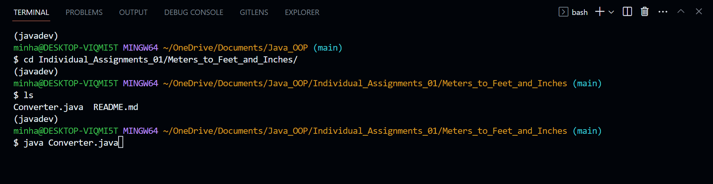

# Java Object-Oriented-Programming Projects 

  

This repository contains a collection of Java projects that demonstrate various concepts and techniques of Object Oriented Programming (OOP) in Java.

This repository serves as a resource for learning and practicing Java OOP concepts. Each project focuses on a specific aspect of OOP and provides examples and exercises to reinforce the concepts. Whether you're a beginner or an experienced Java developer looking to enhance your OOP skills, this repository can be a valuable learning tool.

Feel free to explore each project's directory for detailed information, code samples, and exercises.

---

| Beginner Set | Project Set #1 | Project Set #2 | Project Set #3 | Project Set #4 | Project Set #5 |
| ------------ | -------------- | -------------- | -------------- | -------------- | -------------- |
| [Hello_World](/Hello_World) | [Fahrenheit_to_Kelvin](./Projects_01/Fahrenheit_to_Kelvin) | [Average_and_Sum](./Projects_02/Average_and_Sum) | [Bank_Account](./Projects_03/Bank_Account) | [My_Array_List](./Projects_04/MyArrayList) | [My_Stack](./Projects_05/MyStack) |
|               | [Meters_to_Feet_and_Inches](./Projects_01/Meters_to_Feet_and_Inches) | [Max_and_Min](./Projects_02/Max_and_Min) | [Savings_Account](./Projects_03/Savings_Account) | [My_Linked_List](./Projects_04/MyLinkedList) | [My_Queue](./Projects_05/MyQueue) |
|               | [Names_to_Initials](./Projects_01/Name_to_Initials) | [Odd_and_Even](./Projects_02/Odd_and_Even) |  [Checking_Account](./Projects_03/Checking_Account) | | [My_BS_Tree](./Projects_05/MyBSTree) |
|               | [Diff_Between_Min_and_Max](./Projects_01/Diff_Between_Min_and_Max) | [Range](./Projects_02/Range) | [CreditCard_Account](./Projects_03/CreditCard_Account) |  | [My_Quick_Sort](./Projects_05/MyQuickSort) |
|               | [Make_Box](./Projects_01/Make_Box) | [Count_Greater_Than_Average](./Projects_02/Count_Greater_Than_Average) |  |  |  |
|               | [Pen](./Projects_01/Pen) | [All_In_Range](./Projects_02/All_In_Range) |  |  |  |
|               | | [All_Less_Than_Average](./Projects_02/All_Less_Than_Average) |  |  |  |
|               | | [All_Duplicates](./Projects_02/All_Duplicates) |  |  |  |
|               | | [All_In_Both](./Projects_02/All_In_Both) |  |  |  |

---

### Requirements

To run and experiment with the projects in this repository, ensure that you have the following:

Java Version: 

    openjdk 17.0.3

Utilizing Conda Environment for Java: 

    conda create -name myenv 

    conda activate myenv 

    conda install -c conda-forge openjdk

    If you intend to use Java with a specific IDE, such as Jupyter Notebook, you can install additional packages that enable Java support. 
    For example, install the ijava kernel for Jupyter Notebook:

    conda install -c conda-forge ijava

[Optional] Integrated Development Environment (IDE) such as IntelliJ IDEA or Eclipse for an enhanced development experience. However, using a plain text editor and command-line tools will also suffice.

---

### Usage

To use the projects in this repository, follow these steps:

Clone the repository to your local machine using the following command:

    git clone https://github.com/Mun-Min/Java_OOP

Navigate to the specific project directory you wish to explore:

    cd project-directory

Example of how to utilize `cd` command in Git Version Control Terminal:  

  

Follow the instructions provided in the project's README or source files to understand the concepts and complete any exercises or tasks.

Experiment with the code, modify it, and adapt it to further your understanding of Java OOP.

Happy Coding!

---